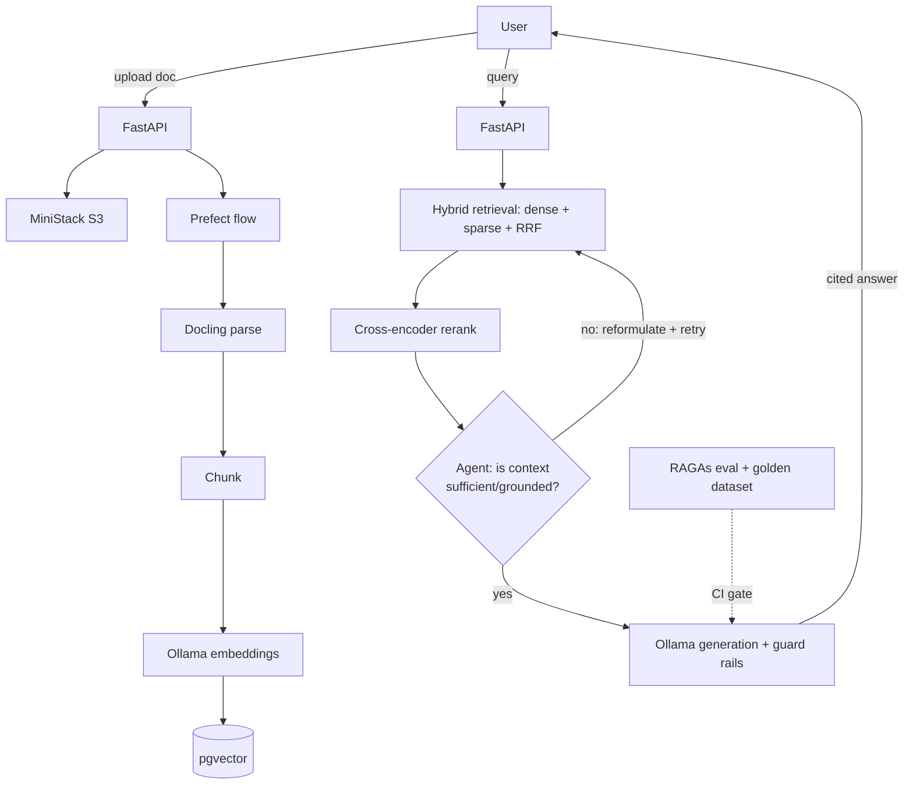

# DIP — Adaptive Agentic Document Intelligence Platform

## What this is

A multi-tenant agentic RAG platform where retrieval quality is measured automatically on every deploy, user feedback improves the system over time, and each tenant's data is fully isolated.

## The real-world problem

**Industry:** Legal / Finance / Healthcare — law firms (contract review), banks (policy Q&A), hospitals (clinical guideline retrieval).

Enterprises have thousands of internal documents but staff can't find or trust AI answers. Hallucinations and stale retrieval kill adoption. Most AI portfolios demo a RAG pipeline with zero way to prove it's actually accurate, and zero way to catch a regression before it ships.

## What I'm building

A production-grade **agentic RAG** platform, not a notebook demo and not a fixed linear pipeline:

- **Multi-modal ingestion** — documents (PDF/DOCX/PPTX/images, including scans) are parsed into structured text, tables, and figures, then chunked and embedded. (Ingestion mechanics are settled — see tech decisions below.)
- **Hybrid retrieval** — dense (vector) + sparse (keyword) retrieval fused together, then reranked.
- **Agentic retrieval-generation loop** — instead of a single retrieve→generate chain, an agent grades whether retrieved context actually supports answering the query, and decides whether to reformulate the query and re-retrieve, retrieve from a different tenant-scoped strategy, or proceed to generation. This is the Self-RAG / Corrective-RAG pattern — retrieval quality is checked *before* generation, not just measured after the fact.
- **Guarded generation** — answers are grounded in cited chunks, with PII redaction and basic prompt-injection defenses.
- **Automatic quality gates** — every change to the pipeline is scored against a golden dataset before it can ship; a regression blocks the build.
- **Multi-tenancy** — each tenant's documents and quotas are isolated from every other tenant.
- **User feedback loop** — thumbs up/down on individual citations feeds back into future improvements.

**Why this matters:** RAG is the #1 production AI use case, but eval-gated, self-correcting (agentic) retrieval is the differentiator — most projects do not have a real eval layer, a CI gate, or a retrieval loop that catches its own bad retrievals before generating an ungrounded answer.

## Architecture at a glance

## Test scenario — multi-industry dummy corpus

To make the multi-tenancy and agentic grading loop demonstrable (not just theoretical), the demo dataset spans the three verticals called out in the portfolio use case, each as its own tenant:

- **Legal tenant** — dummy contracts / NDAs / lease agreements, testing contract-clause retrieval (e.g. "what's the termination notice period in Contract X?").
- **Finance tenant** — dummy internal policy docs / compliance memos, testing policy Q&A (e.g. "what's the approval threshold for wire transfers over $50k?").
- **Healthcare tenant** — dummy clinical guideline excerpts, testing guideline retrieval (e.g. "what's the recommended dosage escalation protocol for drug Y?") — deliberately a domain where an ungrounded/hallucinated answer is highest-stakes, making it the best showcase for the agentic grading loop actually refusing to answer or re-retrieving instead of guessing.

All documents are synthetic/dummy — no real legal, financial, or PHI data. This corpus is what drives the golden eval dataset (Phase 2) and the demo video (Phase 7): one query per vertical showing the agent either answering with a correct citation, or catching insufficient context and reformulating instead of hallucinating.

## Confirmed tech decisions (don't re-litigate these in new chats)

| Concern | Choice | Why |
|---|---|---|
| Orchestration | **Prefect** | Simpler single-tool orchestration with built-in retries/observability; no separate broker needed |
| Document parsing | **Docling** | Multi-modal: PDF/DOCX/PPTX/images, table extraction (TableFormer), OCR fallback for scans |
| LLM + embeddings | **Ollama** — `qwen3:14b`, `nomic-embed-text` | Fully local, zero API cost, zero data leaving the machine |
| Vector store | **pgvector** on Postgres | One database for relational + vector data, no extra service |
| Cache | **Redis** | Semantic query cache |
| Cloud emulation | **MiniStack** (S3, SQS, Secrets Manager, STS) | Zero real AWS spend; free, MIT-licensed LocalStack drop-in; Terraform in Phase 5 targets MiniStack endpoints, not real AWS |
| Local CI/CD | **Jenkins** (Docker) + **SonarQube** (quality gate) + **Trivy** (image scan) | Runs entirely on your desktop, pc or laptop; GitHub trigger via ngrok webhook or Poll SCM |
| Local Kubernetes | **kind or k3d** + **Helm** | Proves k8s config before any real cluster exists |
| Eval | **RAGAs** (faithfulness/recall) + **LangSmith** (tracing) + golden dataset | CI gate blocks a merge that regresses answer quality |
| Agent orchestration | **LangGraph** (lightweight graph: retrieve → grade → generate, with a reformulate/retry edge) | Self-RAG / Corrective-RAG pattern; distinct in scope from Project 2's full multi-agent system |
| Python tooling | **uv**, **ruff**, **mypy**, **pytest**, **pre-commit** | Fast, modern, consistent lint/type/test loop |

## Build philosophy — 8 phases, in order, all local

1. **Scaffold & Bootstrap** — repo, tooling, skeleton FastAPI app, MiniStack baseline.
2. **System Design** — problem brief, diagrams, ADRs, failure modes, capacity math.
3. **Core Build (Docker Compose)** — infra, ingestion, retrieval, generation, eval harness, multi-tenancy.
4. **Local CI/CD (Jenkins)** — Jenkins + SonarQube bootstrap, Jenkinsfile pipeline, quality gates.
5. **Local Kubernetes (kind/k3d)** — Helm charts, scaling/scheduling, ingress, verify from-scratch boot.
6. **Terraform + MiniStack** — IaC modules targeting MiniStack, deploy/destroy/redeploy proof.
7. **Testing & Hardening** — automated test suite, load/chaos testing, security scanning.
8. **Documentation & Portfolio Packaging** — README, design.md, demo video, final CI proof.

## Definition of done for v1

- Upload a document → it's parsed (incl. tables/scans), chunked, embedded, and retrievable.
- A query returns a cited, grounded answer via hybrid retrieval + rerank.
- The agentic grading loop demonstrably catches at least one insufficient-context case per tenant (legal/finance/healthcare) and reformulates/retries instead of generating an ungrounded answer.
- RAGAs eval score is tracked and a CI gate blocks a regression (proven with a deliberately bad change).
- The whole stack boots from a clean clone via Docker Compose, deploys cleanly to a local kind/k3d cluster via Helm, and `terraform apply` stands up the MiniStack-backed resources — all reproducibly, all without touching a real cloud account.
